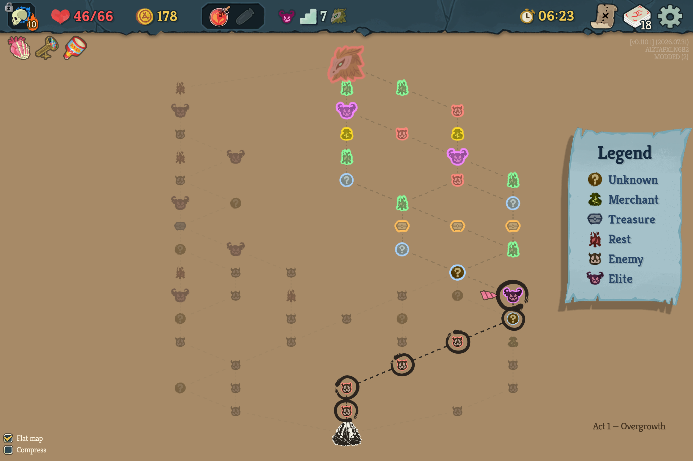

# FlatMap & DeckView — Slay the Spire 2 UI mods

This repository contains **two fully independent mods** for Slay the Spire 2 (each its own DLL,
manifest, config, and compatibility preflight — install either or both):

- **FlatMap** (`flatmap`) — a clearer, optional **whole-act map view**: the vanilla map's own
  vertical layout, compressed so every node of the act fits on one screen.
- **DeckView** (`deckview`) — **zoomed-out deck views**: shrinks deck-like screens so the whole
  deck is visible at a glance; hover pops a card back to full size.

Both change visibility and UI layout only: **they do not alter cards, routes, travel rules, saves,
combat, rewards, or any other gameplay.**

| Flat map page | Mini-cards deck view |
|---|---|
|  |  |

> **Compatibility target: Slay the Spire 2 `v0.109.0`.**
>
> Each mod checks every game hook before enabling. If an STS2 update moves an internal member,
> the mod logs the missing hooks, disables itself, and leaves the vanilla UI running. Harmony
> setup is rolled back if patching fails, so neither mod ever intentionally leaves a
> half-patched UI.

## FlatMap — the whole-act map

STS2's map is a tall vertical scroll: you can never see the whole act at once. FlatMap renders
the **same map** — same orientation (start at the bottom, boss at the top), same rooms, same
connections — compressed vertically so the **whole act fits one screen**, as a real top-level
page (its own top bar, ESC/back, controller routing).

- **The game's own visual language.** The background is the act's own map colour
  (`Act.MapBgColor`), connections are the vanilla **dashed footpaths** in the act's own path
  palette, and every room is the game's real icon art with its natural colours, over the icon's
  main body redrawn in a room-type colour — so each node's outline is the **actual shape of the
  item**, not a circle. The original size language holds: **elites draw larger, the boss
  largest**, using each boss's real icon art. The **game's own Legend panel** appears exactly as
  on the classic map.
- **State at a glance.** Your current spot (blue glow + double ring + the game's own
  "you are here" arrow), your legal next moves (bright halos, relic-aware incl. Wing Boots),
  your past route (dimmed, and a visited `?` adopts the room it turned out to be), and rooms you
  can no longer reach (greyed, edges faded). Click a highlighted room to travel via the game's
  own selection path.
- **Two checkboxes** (bottom-left, saved across runs): **Flat map** (flat vs. classic rendering)
  and **Compress** (off by default — raw 1:1 with the game's columns; on = our lane-compression,
  which provably changes nothing but spacing).
- **Standard controls always work:** the top-bar map button, the map room, and **M** all toggle
  the map in either mode; **O** flips flat↔classic while a map is up; ESC/back leaves the map.
- It only ever *reads* the live map — it never changes your run.

**Compaction (the interesting part).** The act is squeezed onto one screen without ever changing
which rooms connect. The key invariant: every step preserves each floor's *column order*, so the
crossing count is identical to the game's — compaction can only reassign display lanes, never
scramble connectivity or overlap two rooms. It's proven offline in `layout/`: a pure `MapLayout`
algorithm + an invariant checker + metrics + a 500-map property test + captured real levels + viz
tooling. A runtime assert crashes rather than draw an illegal layout.

The page is a real capstone screen (`MiniMapScreen : ICapstoneScreen` via `NCapstoneContainer`),
exactly like the game's own deck-view screen, and reads live state straight off `NMapScreen`
(`_mapPointDictionary`, `_runState`, the real icon/outline textures, `IsTravelEnabled`).

## DeckView — the deck zoom

STS2 draws deck-like views at a size where only a handful of cards fit on screen. DeckView
(the direct heir of the STS1 mod of the same name) shrinks those cards so more of the deck fits
at once.

- **Shrinks:** the deck view, the draw / discard / exhaust piles, the card library, and the deck
  card-select screens.
- **Left at normal size:** the combat hand, the inspect popup, and the choose-a-card,
  card-reward, unlock, shop, and card-bundle screens.
- **Hover** pops a card to full size; move off and it shrinks back (with the game's own un-hover
  path, so hover tips dismiss exactly like vanilla — including the "one card opens stuck-big"
  stale-hover case, reconciled every frame).
- **Toggle any time:** the on-screen **Mini-cards** tickbox (next to *View upgrades*) or **T**.
  Persisted in `user://deckview.cfg`.

Under the hood: `NCardGrid` is already responsive — the column count, row count and scroll
bounds all derive from the per-card layout size (`_cardSize`) and `CardPadding` — so the mod
shrinks the layout cell and the rendered scale together and everything reflows. Tunables
(`CardScaleFactor` 0.6, `CardPadding` 24, `ToggleDeckModeKey` T) sit at the top of
`deckview/DeckViewMod.cs`.

## Requirements

- Slay the Spire 2 `v0.109.0`.
- No gameplay dependencies. Both mods use the game's built-in mod loader.

## Install

Download the archives you want from
[GitHub Releases](https://github.com/ernop/sts2-deckview/releases), then extract into the game's
`mods` directory:

```text
Slay the Spire 2/
└── mods/
    ├── flatmap/
    │   ├── flatmap.dll
    │   └── flatmap.json
    └── deckview/
        ├── deckview.dll
        └── deckview.json
```

Launch STS2 using Steam's **Play with Mods** option, enable the mod(s) in the **Mods** menu,
and restart when prompted.

## Build from source

Building requires the .NET 9 SDK and an installed copy of STS2. Both projects reference the
game-provided `sts2.dll`, `GodotSharp.dll`, and `0Harmony.dll`; none are bundled.

```powershell
# from the repo root, on Windows — builds BOTH mods and installs them:
.\scripts\build.ps1 -Install
```

Or per mod: `dotnet build flatmap.csproj -c Release -o bin` /
`dotnet build deckview\deckview.csproj -c Release -o deckview\bin`, then copy each DLL +
manifest into `…\Slay the Spire 2\mods\<id>\`.

A/B check: launch with `--nomods` to see vanilla for comparison.

See [`DEVELOPMENT.md`](DEVELOPMENT.md) for the full dev setup — decompiling the game
(`ilspycmd`), the map data model, compatibility preflight, and release checks — and
[`docs/requirements.md`](docs/requirements.md) for the living product spec (including the
map-drawing design directives).

## Status / caveats

- Targets STS2 `v0.109.0`; `TestedGameVersion` in each mod and `min_game_version` in each
  manifest record that target. Build, hook, and in-game checks in `PUBLISHING.md` are release
  gates.
- Mouse, keyboard, and controller can activate every checkbox. On the flat map, controller
  focus starts on a legal destination; directional input moves between destinations and accept
  travels there.
- Both mods use private game members, so every STS2 update requires verification.
  `scripts/verify-hooks.sh` and each mod's in-game preflight maintain the complete hook
  inventory. Missing hooks disable the affected mod cleanly and preserve vanilla behavior.
- Full build and in-game checks require an installed copy of STS2 and cannot run in public CI.
- To support a newer game build: rebuild against its `sts2.dll`, then bump `TestedGameVersion`
  and each manifest's `min_game_version` / description.

## License

Available under the [MIT License](LICENSE). Slay the Spire 2 and its assets are owned by
Mega Crit. Repository screenshots depict the game UI; the install archives contain only each
mod's DLL and manifest.
